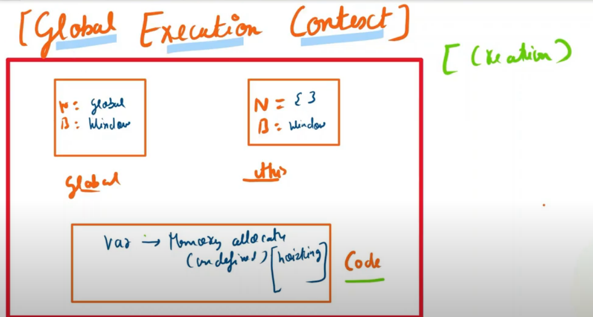
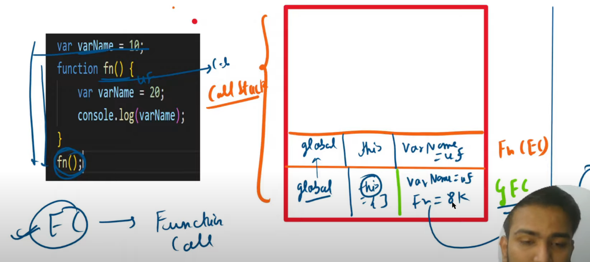
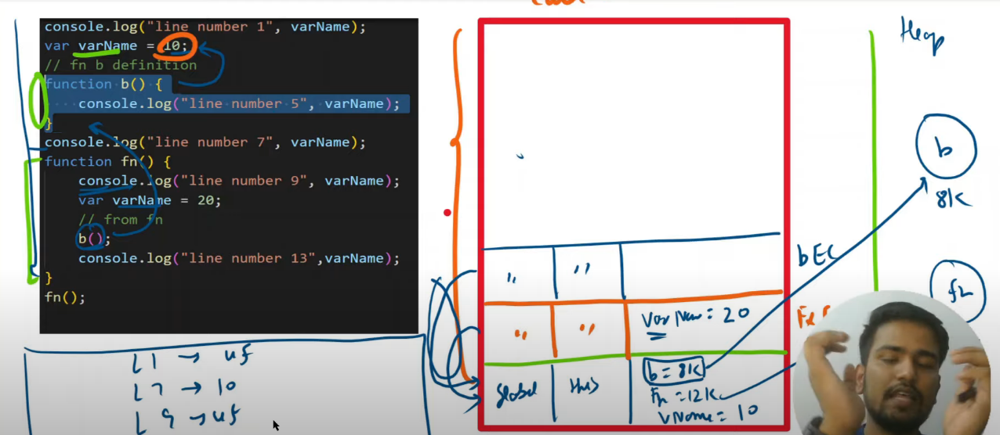
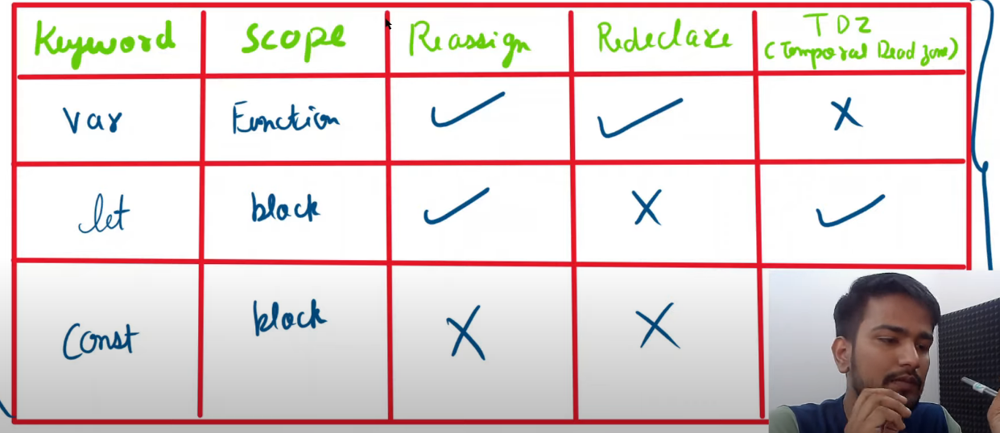

###  what is js 
  * it runs under js runtime environment ?

Features are given by the enviroment, such as node js or browser , like printing console out is implemented by the browser and logic is given by the language.

features are decided by the language and then these  features are implemented by the browsers, echma script is written periodically . 

 * node js - env under which js runs which has lot of features 
 * react js  - so changing UI and all is costly, so the algo need to be optimsed, so this optimisation work is done by the react js, we just need to write the code in react js in jss language 

### exectuion  context ( wrapper)

 * js does not have main  , so on running the program , execution context is made   
 * it has global  object and this 
  * code which is not inside function is global area code  
  *  wrapper made for this code  is global execution context  , in case of window , it runs under the window object and in case of node js it runs under the global .
 

* let us see an example to understand how execution contexts are created for each function when they are called
  and how the variables etc are allocated for that 

### execution context and  scope 
* each funtion has its own execution context ( so a new  execution context is formed at each call of the function ), and the global and this are passed like in the picture , 
  so basically first creation  of execution context takes place and  then code runs
* see the below figure to see how function see lexicographically outside 

* this figure will demonstarate how the scope is defined for a function 

### var and their summary 

* ( last entity is ✅)